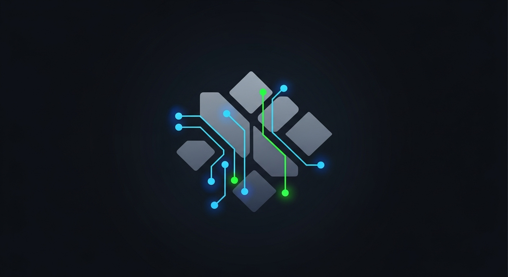

# SourceBox OmniLocal



## What is SourceBox OmniLocal?

SourceBox OmniLocal is a user-friendly desktop AI assistant that runs completely on your own computer. Unlike cloud-based AI assistants that send your data to remote servers, OmniLocal processes everything locally using your computer's own resources, giving you both privacy and control.

The application provides a beautiful, modern interface where you can chat with powerful AI models and use a variety of helpful tools - all without your conversations or data ever leaving your computer.

## Why Use SourceBox OmniLocal?

- **Privacy First**: Your conversations stay on your computer
- **No Internet Required**: Works even when offline
- **No Subscription Costs**: Use your own local AI models for free
- **Customizable**: Choose different AI models and customize the interface
- **Powerful Tools**: Access to file management, web search, screenshots, and more
- **Beautiful Interface**: Modern design with light and dark themes

## System Requirements

- **Operating System**: Windows 10/11 (Mac and Linux support coming soon)
- **RAM**: Minimum 8GB (16GB+ recommended for better performance)
- **Storage**: At least 2GB free space (more depending on which models you install)
- **Processor**: Modern multi-core CPU (AI models run faster with better CPUs)
- **GPU**: Optional but recommended for faster AI processing
- **Software Dependencies**:
  - [Python 3.8+](https://www.python.org/downloads/)
  - [Ollama](https://ollama.ai/download) (for running AI models locally)

## Installation

### Step 1: Install Ollama
1. Download Ollama from [ollama.ai/download](https://ollama.ai/download)
2. Follow the installation instructions for your operating system
3. After installation, Ollama will run as a service in the background

### Step 2: Install SourceBox OmniLocal
1. Download the latest release from the official repository
2. Extract the files to a location of your choice
3. Run the installer or use pip to install the required dependencies:
```bash
pip install -r requirements.txt
```

### Step 3: Start the Application
```bash
flet run src/main.py
```

Or use the provided executable if you downloaded a pre-built version.

## Getting Started

When you first launch SourceBox OmniLocal, the application will:

1. Check if Ollama is running correctly on your system
2. Display available AI models from your Ollama installation
3. Present you with a clean chat interface to start interacting

If this is your first time using Ollama, you may need to download a model. The application will guide you through this process, or you can use the Ollama command line:
```bash
ollama pull llama3
```

## Features

### Chat Interface
- Clean, modern chat bubbles for your conversations
- Beautiful markdown rendering for AI responses
- Support for code blocks with syntax highlighting
- Clickable links that open in your browser
- Theme options (light/dark mode) with accent color choices

### File Handling
- Upload multiple files to share with the AI assistant
- Persistent file queue display above the input field
- Easy management of queued files (remove individual files or clear all)
- Automatic temporary file storage and cleanup

### AI Models
- Choose from different locally-installed Ollama models:
  - Llama 3.2
  - Llama 3.1
  - CodeLlama
  - Mistral
  - (And any other models you've downloaded through Ollama)
- Switch between models during conversations

### Built-in Tools

SourceBox OmniLocal includes numerous helpful tools that can be accessed through simple text commands:

#### System Tools
- **System Information**: Get details about your computer's hardware and performance
- **Launch Applications**: Start programs on your computer
- **Close Applications**: Shut down running applications
- **Screenshot**: Capture images of your screen or specific windows
- **Set Wallpaper**: Change your desktop background

#### File Operations
- **File Management**: List, copy, move, delete, and rename files
- **Create Files and Folders**: Make new documents and directories
- **Open in Editor**: Launch files in your favorite code editor

#### Web & Search
- **Web Search**: Find information online through DuckDuckGo
- **Extract Webpage Content**: Pull text from websites for analysis

#### Media & Gaming
- **Image Generation**: Create AI-generated images from text descriptions
- **Image Description**: Get AI analysis of image content
- **Game Launcher**: Find and start installed PC games

#### Productivity
- **Timer**: Set reminders and countdowns with natural language
- **Document Loading**: Extract text from various document formats

### Settings & Customization
- Theme selection (Dark/Light/Auto)
- Accent color options (Blue/Green/Purple/Orange)
- AI model selection
- Tool enabling/disabling
- API key management for external services

## How to Use

### Basic Interaction
Simply type your message in the input field at the bottom of the screen and press Enter or click the send button. The AI assistant will respond in the chat area above.

**Example conversations you can try:**
- "What's the weather forecast for today?"
- "Can you explain how photosynthesis works?"
- "Write a short poem about autumn leaves"
- "Help me debug this Python code: [paste code here]"

### Using Tools
To use any of the built-in tools, simply ask for what you need in natural language:

**Examples:**
- "Take a screenshot of my desktop"
- "Search the web for chocolate cake recipes"
- "List the files in my Documents folder"
- "Generate an image of a mountain sunset"
- "Set a timer for 10 minutes"

### Working with Files
1. Click the paperclip icon (📎) in the input area
2. Select one or more files from your computer
3. The files will appear in a horizontal row above the input field
4. Type a message that references these files (e.g., "Summarize this PDF" or "Explain this code")
5. Press Enter to send both your message and the files to the AI assistant

### Customizing Settings
1. Click the gear icon (⚙️) in the top right corner to open Settings
2. Change appearance settings, AI model, or enable/disable specific tools
3. Click "Save Changes" to apply your preferences

## Performance Optimization

### System Resource Usage
The application displays CPU, RAM, and GPU usage in the status bar to help you monitor performance. If you notice the application running slowly:

1. Try switching to a smaller, more efficient AI model
2. Close other resource-intensive applications
3. Ensure your computer meets the recommended system requirements

### Model Selection
Different models offer different balances of speed and capabilities:
- Smaller models (1-7B parameters) run faster but may have limited capabilities
- Larger models (8-70B parameters) provide better responses but require more resources

## Troubleshooting

### Common Issues

**Ollama Not Connecting**
- Ensure Ollama is installed and running (check for the Ollama icon in your system tray)
- Restart the Ollama service if needed
- Verify no firewall is blocking the connection

**Slow AI Responses**
- Switch to a smaller AI model
- Check your system resources (CPU/RAM usage)
- Ensure your computer meets the minimum requirements

**File Upload Problems**
- Check that the file type is supported
- Ensure the file isn't too large (stay under 20MB per file)
- Verify you have read permissions for the file

**Tool Execution Failures**
- Make sure all required dependencies are installed
- Check that you have the necessary system permissions
- For web-based tools, verify your internet connection

### Getting Help
If you encounter issues not covered in this documentation:
1. Check the GitHub repository issues page
2. Join the community Discord server
3. Submit a detailed bug report including your system specifications and steps to reproduce the problem

## Privacy & Data Usage

SourceBox OmniLocal is designed with privacy as a core principle:

- **Local Processing**: All AI processing happens on your device
- **No Data Collection**: Your conversations are not sent to any servers
- **Temporary Storage**: Files are stored in a temporary directory and cleaned up automatically
- **Optional Features**: Web search requires internet access but no account registration

## Advanced Features

### API Keys
Some optional tools (like AI image generation) may require API keys for external services. These can be entered in the Settings page and are stored locally on your device.

### Custom Model Configuration
Advanced users can modify model parameters by editing the settings file located at:
```
~/.local_ollama_agent/settings.json
```

## Legal & Credits

SourceBox OmniLocal is developed by SourceBox LLC and is provided under [license terms].

The application uses the following open-source technologies:
- Flet: For the graphical user interface
- Ollama: For running local AI models
- Various Python libraries listed in requirements.txt

---

*This documentation is current as of July 2025. For the latest information, please check the official repository.*
